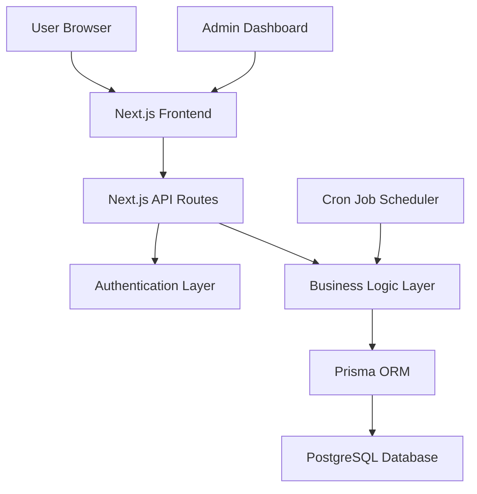

# Design Document

## Overview

The SaaS Member System is a Next.js-based web application that provides user registration, admin approval workflows, credit-based access control, and automated daily credit deduction. The system uses a modern tech stack with PostgreSQL database, Prisma ORM, NextAuth.js for authentication, and Shadcn/ui for the user interface.

## Architecture

### High-Level Architecture



### Technology Stack

**Frontend:**
- Next.js 14+ with TypeScript
- Tailwind CSS for styling
- Shadcn/ui component library
- React Hook Form for form management
- Zod for validation

**Backend:**
- Next.js API routes
- NextAuth.js for authentication
- Prisma ORM for database operations
- bcrypt for password hashing

**Database:**
- PostgreSQL for production
- Prisma for schema management and migrations

**Automation:**
- node-cron for scheduled tasks
- Custom API endpoint for credit deduction

**Deployment:**
- Vercel (recommended) or similar platform
- Environment variables for configuration

## Components and Interfaces

### Database Schema

```prisma
model User {
  id                    String   @id @default(cuid())
  email                 String   @unique
  password              String
  status                UserStatus @default(PENDING)
  credits               Int      @default(0)
  role                  UserRole @default(USER)
  registrationDate      DateTime @default(now())
  lastCreditDeduction   DateTime?
  createdAt             DateTime @default(now())
  updatedAt             DateTime @updatedAt
  
  creditLogs            CreditLog[]
  
  @@map("users")
}

model CreditLog {
  id          String   @id @default(cuid())
  userId      String
  amount      Int
  type        CreditLogType
  reason      String?
  adminId     String?
  createdAt   DateTime @default(now())
  
  user        User     @relation(fields: [userId], references: [id], onDelete: Cascade)
  
  @@map("credit_logs")
}

enum UserStatus {
  PENDING
  APPROVED
  REJECTED
  BLOCKED
}

enum UserRole {
  USER
  ADMIN
}

enum CreditLogType {
  ADDED
  DEDUCTED
  DAILY_DEDUCTION
}
```

### API Endpoints

**Authentication:**
- `POST /api/auth/register` - User registration
- `POST /api/auth/signin` - User login (NextAuth)
- `POST /api/auth/signout` - User logout (NextAuth)

**User Management:**
- `GET /api/users` - Get all users (admin only)
- `PUT /api/users/[id]/status` - Update user status (admin only)
- `PUT /api/users/[id]/credits` - Update user credits (admin only)
- `GET /api/users/me` - Get current user data

**Credit Management:**
- `POST /api/credits/deduct-daily` - Daily credit deduction (cron job)
- `GET /api/credits/logs/[userId]` - Get credit history

**Dashboard:**
- `GET /api/dashboard/stats` - Get dashboard statistics (admin only)

### Frontend Components

**Shared Components:**
- `Layout` - Main application layout with navigation
- `ProtectedRoute` - Route wrapper for authentication
- `AdminRoute` - Route wrapper for admin access
- `LoadingSpinner` - Loading state component
- `Toast` - Notification component

**User Components:**
- `RegisterForm` - User registration form
- `LoginForm` - User login form
- `UserDashboard` - User credit display and status
- `CreditDisplay` - Credit balance component

**Admin Components:**
- `AdminDashboard` - Main admin interface
- `UserTable` - Data table for user management
- `UserActions` - Approve/reject/credit management
- `CreditManager` - Credit addition/subtraction interface
- `UserStats` - System statistics display

## Data Models

### User Model
```typescript
interface User {
  id: string;
  email: string;
  password: string; // hashed
  status: 'PENDING' | 'APPROVED' | 'REJECTED' | 'BLOCKED';
  credits: number;
  role: 'USER' | 'ADMIN';
  registrationDate: Date;
  lastCreditDeduction: Date | null;
  createdAt: Date;
  updatedAt: Date;
}
```

### Credit Log Model
```typescript
interface CreditLog {
  id: string;
  userId: string;
  amount: number;
  type: 'ADDED' | 'DEDUCTED' | 'DAILY_DEDUCTION';
  reason?: string;
  adminId?: string;
  createdAt: Date;
}
```

### API Response Types
```typescript
interface ApiResponse<T> {
  success: boolean;
  data?: T;
  error?: string;
  message?: string;
}

interface UserWithStats extends User {
  estimatedExpiryDate: Date | null;
  daysSinceRegistration: number;
}
```

## Error Handling

### Frontend Error Handling
- Form validation using Zod schemas
- Toast notifications for user feedback
- Error boundaries for component-level errors
- Loading states for async operations

### Backend Error Handling
- Try-catch blocks for all API routes
- Standardized error response format
- Logging for debugging and monitoring
- Graceful degradation for non-critical features

### Database Error Handling
- Connection retry logic
- Transaction rollback on failures
- Constraint violation handling
- Migration error recovery

## Testing Strategy

### Unit Testing
- Component testing with React Testing Library
- API route testing with Jest
- Database model testing
- Utility function testing

### Integration Testing
- Authentication flow testing
- Credit deduction process testing
- Admin workflow testing
- Database integration testing

### End-to-End Testing
- User registration and approval flow
- Credit management workflows
- Daily deduction automation
- Admin dashboard functionality

### Test Structure
```
/tests
  /components     # Component unit tests
  /api           # API route tests
  /integration   # Integration tests
  /e2e           # End-to-end tests
  /utils         # Test utilities and mocks
```

## Security Considerations

### Authentication Security
- Password hashing with bcrypt (salt rounds: 12)
- JWT token validation for API routes
- Session management with NextAuth.js
- CSRF protection enabled

### Authorization
- Role-based access control (RBAC)
- Route-level protection for admin endpoints
- Client-side route guards
- API endpoint permission validation

### Data Protection
- Input validation and sanitization
- SQL injection prevention via Prisma
- XSS protection with proper escaping
- Rate limiting for sensitive endpoints

### Environment Security
- Environment variables for secrets
- Database connection string protection
- API key management
- Secure cookie configuration

## Performance Optimization

### Database Optimization
- Indexed columns for frequent queries
- Connection pooling
- Query optimization
- Pagination for large datasets

### Frontend Optimization
- Code splitting with Next.js
- Image optimization
- Static generation where possible
- Component memoization

### Caching Strategy
- API response caching
- Static asset caching
- Database query caching
- Session data caching

## Deployment Architecture

### Production Environment
- Vercel deployment with PostgreSQL database
- Environment variable configuration
- Automated deployments from Git
- Health check endpoints

### Database Setup
- PostgreSQL instance (Vercel Postgres or external)
- Prisma migrations for schema management
- Connection pooling configuration
- Backup and recovery procedures

### Monitoring and Logging
- Application performance monitoring
- Error tracking and alerting
- Database performance monitoring
- User activity logging

## Automation Implementation

### Daily Credit Deduction
```typescript
// Cron job configuration
const cronJob = cron.schedule('0 0 * * *', async () => {
  await deductDailyCredits();
}, {
  timezone: 'UTC'
});

// Credit deduction logic
async function deductDailyCredits() {
  const users = await prisma.user.findMany({
    where: { status: 'APPROVED', credits: { gt: 0 } }
  });
  
  for (const user of users) {
    await prisma.$transaction([
      prisma.user.update({
        where: { id: user.id },
        data: {
          credits: Math.max(0, user.credits - 1),
          status: user.credits <= 1 ? 'BLOCKED' : user.status,
          lastCreditDeduction: new Date()
        }
      }),
      prisma.creditLog.create({
        data: {
          userId: user.id,
          amount: -1,
          type: 'DAILY_DEDUCTION',
          reason: 'Daily automatic deduction'
        }
      })
    ]);
  }
}
```

This design provides a comprehensive foundation for building the SaaS member system with all required features, proper security measures, and scalable architecture.